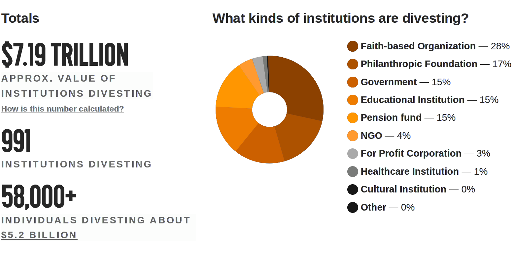

# Why BSWA should put its money in ethical banking

Due to ethical concerns, especially with fossil fuel investment, we propose that the BSWA transition its investments from Bankwest to Bendigo Bank.

Fossil fuel divestment is the act of withdrawing funds from financial institutions that invest in fossil fuels. It is an ethical statement, which declares that we refuse to profit from activities that cause global warming. Globally, faith-based organizations have been leaders in divestment. We should place morality over profit.

## Bankwest vs. Bendigo

- Bankwest is owned by the Commonwealth Bank, which has loaned over $26 billion to fossil fuels since 2008. [Marketforces](https://www.marketforces.org.au/info/compare-bank-table/)
- Of the Big Four banks, Commonwealth Bank has the worst ratio of fossil fuel to renewable energy lending: $13 to fossil fuels for every $1 to renewable energy since 2008. [Marketforces](http://www.marketforces.org.au/revealed-billions-loaned-to-fossil-fuels-by-the-big-banks/)

Bendigo Bank [does not lend any money to fossil fuels](https://www.bendigobank.com.au/public/news-and-media/news/news-archive/our-statement-about-lending-to-projects-in-the-coal-and-coal-seam-gas-sectors).

> Australia’s fifth largest bank, Bendigo and Adelaide, with 1.6 million customers nationwide, has taken a public stand not to invest in coal and gas projects, thereby joining a number of big superannuation funds, as well as some educational institutions, some smaller banks and the Uniting Church.
[District Bulletin](https://districtbulletin.com.au/congratulations-bendigo-bank-goes-fossil-free/)

Bendigo Bank is a large and secure bank with a [solid credit rating](https://www.bendigoadelaide.com.au/public/shareholders/credit_rating/credit_rating.asp) and [competitive term deposit interest rates](https://www.bendigobank.com.au/public/personal/term-deposits#tab-335821).

## Our proposal

The BSWA currently has around $4 million in term deposits, and a variety of smaller accounts. We propose to open term deposit accounts with Bendigo as an initial step towards removing all accounts from Bankwest.
